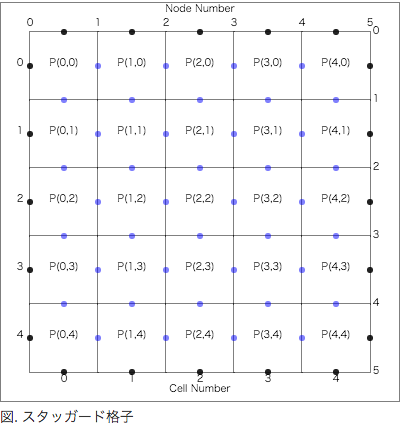
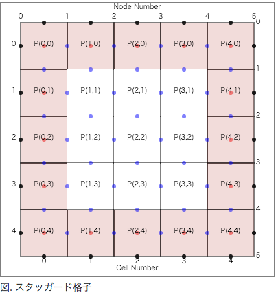

# StaggeredGridJS
スタッガード格子を書くjsスクリプト. HTMLで数式等を取り扱う際に便利なスクリプト.

Version : 1.0

## 使い方
```
<div class="StaggeredGridJS" I="4" J="4" pml=0 w=500 h=500></div>
<p>図. スタッガード格子</p>
```

  

## プロパティ
- I:X方向セル数
- J:Y方向セル数
- pml:PML層数
- w:図の横幅
- h:図の縦幅


## おまけ機能

PML吸音境界を表示することができます。pmlプロパティを指定してください。


